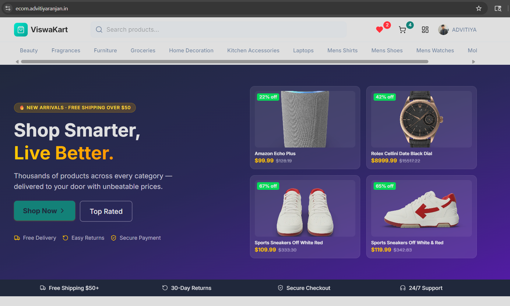
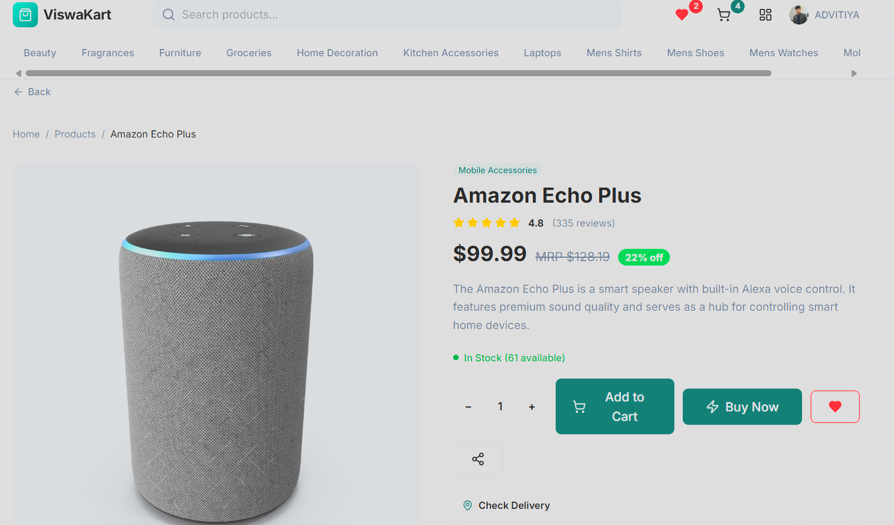
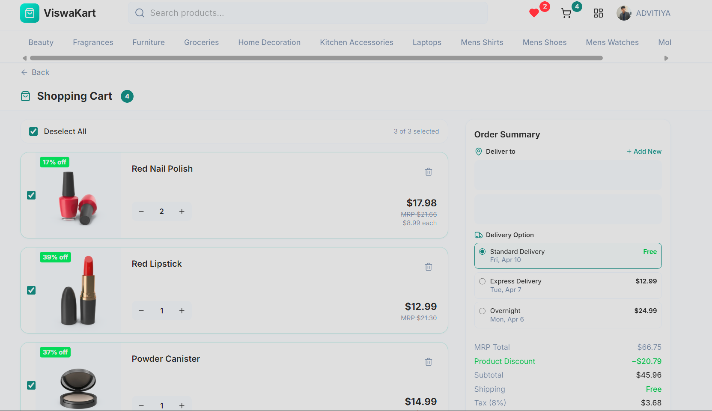

# ViswaKart

A full-stack e-commerce platform built with React, Node.js, and MongoDB — featuring product browsing, cart & wishlist, Stripe payments, role-based admin dashboard, and Google OAuth authentication.

🌐 **Live:** [ecom.advitiyaranjan.in](https://ecom.advitiyaranjan.in)

---

## Screenshots

### Homepage


### Product Detail


### Shopping Cart


---

## Features

- **Authentication** — Clerk-based auth, Google OAuth 2.0, JWT-protected API routes
- **Product Catalog** — Browse, search, and filter products by category with discount badges
- **Product Detail** — Image gallery, ratings & reviews, stock indicator, delivery check
- **Cart** — Add/remove/update items, quantity control, order summary with delivery options
- **Wishlist** — Save products for later
- **Checkout / Buy Now** — Full cart checkout and single-item buy-now flows
- **Payments** — Stripe payment intents; Card, PayPal, and COD support
- **Orders** — Full lifecycle tracking: Pending → Processing → Shipped → Delivered → Cancelled
- **Admin Dashboard** — Manage products, categories, orders, and users; stats overview
- **Email Notifications** — Transactional emails via Nodemailer (OTP verification, order updates)
- **Security** — Helmet, rate limiting, MongoDB sanitization, CORS whitelist, Svix webhook verification

---

## Tech Stack

### Frontend
| Category | Technology |
|---|---|
| Framework | React 18 + Vite 6 |
| Routing | React Router 7 |
| Styling | Tailwind CSS 4, shadcn/ui (Radix UI), MUI 7 |
| Forms & Validation | React Hook Form 7, Zod 4 |
| State Management | React Context API |
| Payments | Stripe.js |
| Auth | Clerk React |
| HTTP | Axios |
| Animation | Framer Motion 12 |
| Charts | Recharts |

### Backend
| Category | Technology |
|---|---|
| Runtime | Node.js ≥18 + Express 4 |
| Database | MongoDB + Mongoose 8 |
| Auth | Clerk Backend, Passport + Google OAuth 2.0, JWT, bcryptjs |
| Payments | Stripe 22, Svix (Clerk webhooks) |
| Email | Nodemailer |
| Security | Helmet, express-rate-limit, express-mongo-sanitize, CORS |
| Validation | express-validator |

---

## Project Structure

```
ViswaKart/
├── Client/               # React frontend (Vite)
│   ├── src/
│   │   ├── app/
│   │   │   ├── pages/    # All page components
│   │   │   ├── layouts/  # UserLayout, AdminLayout
│   │   │   └── components/
│   │   ├── context/      # AuthContext, CartContext
│   │   ├── services/     # API service functions
│   │   └── lib/          # Zod validation schemas
│   └── vercel.json
├── server/               # Express backend
│   ├── controllers/      # Route handlers
│   ├── models/           # Mongoose models
│   ├── routes/           # Express routers
│   ├── middleware/        # Auth & error middleware
│   ├── config/           # DB & Passport config
│   └── utils/            # Email, seeder utilities
├── screenshots/
└── vercel.json
```

---

## Pages & Routes

### User-Facing
| Path | Page |
|---|---|
| `/` | Homepage |
| `/products` | Product Listing |
| `/products/:id` | Product Detail |
| `/search` | Search Results |
| `/cart` | Shopping Cart |
| `/wishlist` | Wishlist |
| `/checkout` | Checkout *(protected)* |
| `/buy-now` | Buy Now *(protected)* |
| `/account` | Account *(protected)* |
| `/login` | Login |
| `/signup` | Signup |

### Admin
| Path | Page |
|---|---|
| `/admin` | Dashboard |
| `/admin/products` | Product Management |
| `/admin/categories` | Category Management |
| `/admin/orders` | Order Management |
| `/admin/users` | User Management |

---

## API Reference

### Auth — `/api/auth`
| Method | Endpoint | Access |
|---|---|---|
| GET | `/me` | Protected |
| PUT | `/me` | Protected |
| POST | `/me/addresses` | Protected |
| PUT | `/me/addresses/:id` | Protected |
| DELETE | `/me/addresses/:id` | Protected |

### Products — `/api/products`
| Method | Endpoint | Access |
|---|---|---|
| GET | `/` | Public |
| GET | `/:id` | Public |
| POST | `/` | Admin |
| PUT | `/:id` | Admin |
| DELETE | `/:id` | Admin |
| POST | `/:id/reviews` | Protected |

### Orders — `/api/orders`
| Method | Endpoint | Access |
|---|---|---|
| POST | `/` | Protected |
| GET | `/my` | Protected |
| GET | `/` | Admin |
| GET | `/:id` | Protected |
| PUT | `/:id/status` | Admin |
| PUT | `/:id/cancel` | Protected |

### Payments — `/api/payments`
| Method | Endpoint | Access |
|---|---|---|
| POST | `/create-intent` | Protected |
| POST | `/confirm-order` | Protected |

### Categories — `/api/categories`
| Method | Endpoint | Access |
|---|---|---|
| GET | `/` | Public |
| POST | `/` | Admin |
| PUT | `/:id` | Admin |
| DELETE | `/:id` | Admin |

### Users — `/api/users`
| Method | Endpoint | Access |
|---|---|---|
| GET | `/dashboard` | Admin |
| GET | `/` | Admin |
| PUT | `/:id` | Admin |
| DELETE | `/:id` | Admin |

---

## Getting Started

### Prerequisites
- Node.js ≥18
- MongoDB (local or Atlas)
- pnpm (frontend)

### Backend Setup

```bash
cd server
npm install
```

Create a `.env` file in `server/`:

```env
PORT=5000
MONGODB_URI=your_mongodb_connection_string
JWT_SECRET=your_jwt_secret
CLIENT_URL=http://localhost:5173
CLERK_SECRET_KEY=your_clerk_secret_key
CLERK_WEBHOOK_SECRET=your_svix_webhook_secret
STRIPE_SECRET_KEY=your_stripe_secret_key
GOOGLE_CLIENT_ID=your_google_client_id
GOOGLE_CLIENT_SECRET=your_google_client_secret
EMAIL_FROM="ViswaKart" <noreply@viswakart.com>
NODEMAILER_HOST=smtp.example.com
NODEMAILER_PORT=587
NODEMAILER_USER=your_email
NODEMAILER_PASS=your_password
```

```bash
npm run dev
```

### Frontend Setup

```bash
cd Client
pnpm install
```

Create a `.env` file in `Client/`:

```env
VITE_API_URL=http://localhost:5000
VITE_CLERK_PUBLISHABLE_KEY=your_clerk_publishable_key
VITE_STRIPE_PUBLISHABLE_KEY=your_stripe_publishable_key
```

```bash
pnpm run dev
```

---

## Deployment

Both frontend and backend are deployed on **Vercel**.

- **Frontend** — React SPA with catch-all rewrite to `index.html`
- **Backend** — Express serverless function via `server/api/index.js`

The root `vercel.json` routes all traffic to the Express handler. The `Client/vercel.json` configures the SPA rewrite.

---

## Database Models

| Model | Description |
|---|---|
| `User` | Stores user profile, hashed password, Clerk/Google IDs, role, addresses |
| `Product` | Product info, pricing, images, category ref, embedded reviews |
| `Order` | Order items, shipping address, payment details, status lifecycle |
| `Category` | Product categories (name, slug, image) |
| `Otp` | Short-lived OTP records for email verification |

---

## License

MIT
